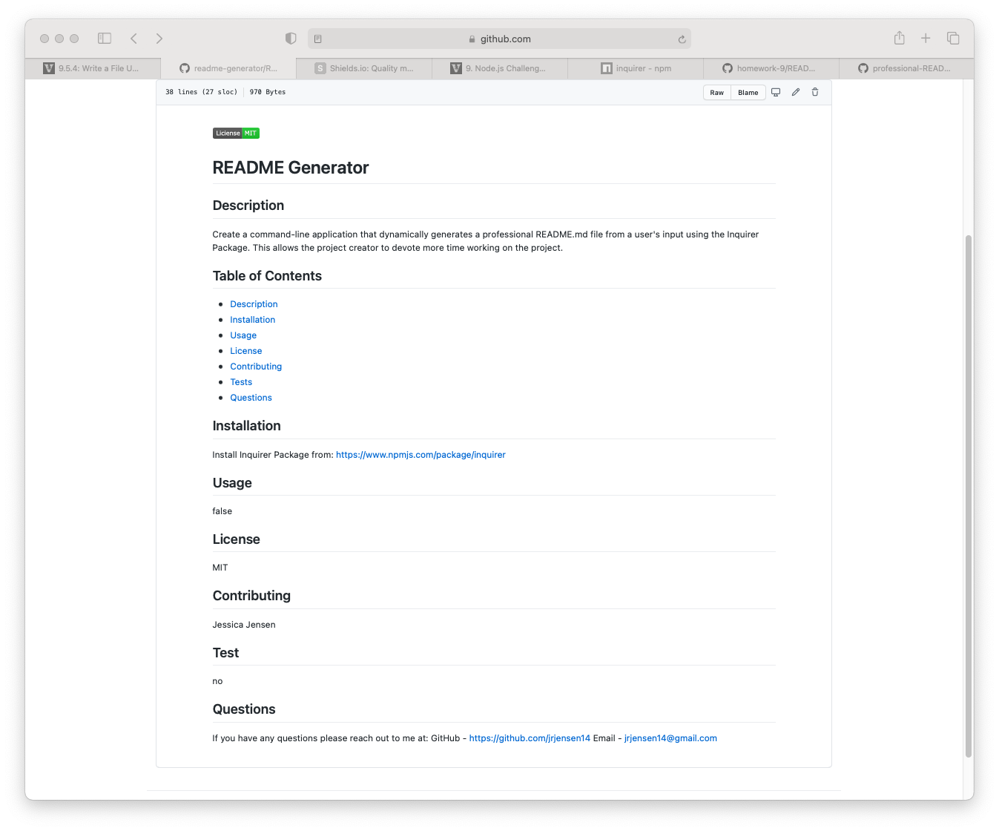

# README Generator 

  ## Table of Contents:
  * [Description](#description)
  * [Installation](#installation)
  * [Usage](#usage)
  * [Questions](#questions)

  ## Description:
  Create a command-line application that dynamically generates a professional README.md file from a user's input using the Inquirer Package. This allows the project creator to devote more time working on the project.

  ## Installation:
  npm Inquirer Package 

  ## Usage:
  

  #### Video:
https://drive.google.com/file/d/1w9iU7-Vhdk1HCMXVJCC3FPBLLP6VUR9H/view

  ## Questions:
  If you have any questions please reach out to me at:

  GitHub - https://github.com/jrjensen14
  
  Email - jrjensen@gmail.com

